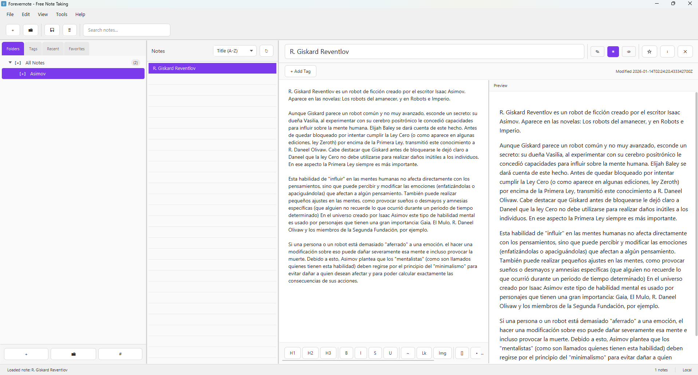
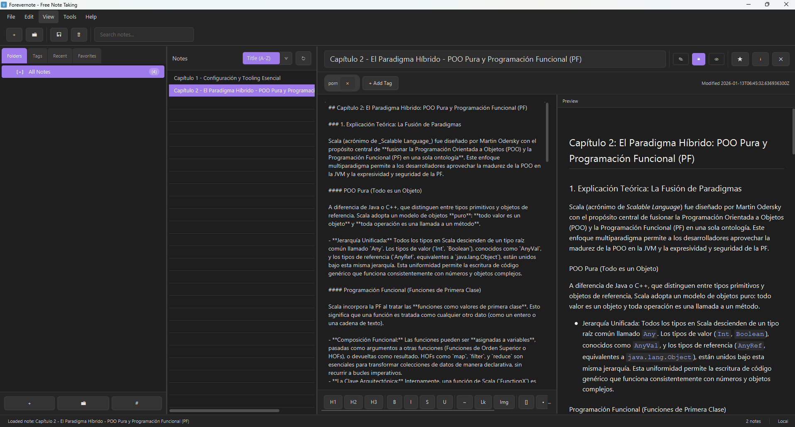
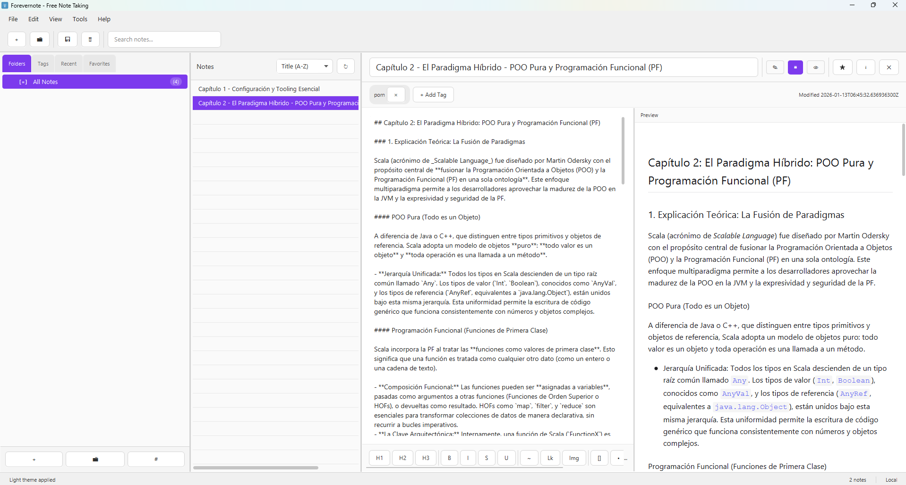
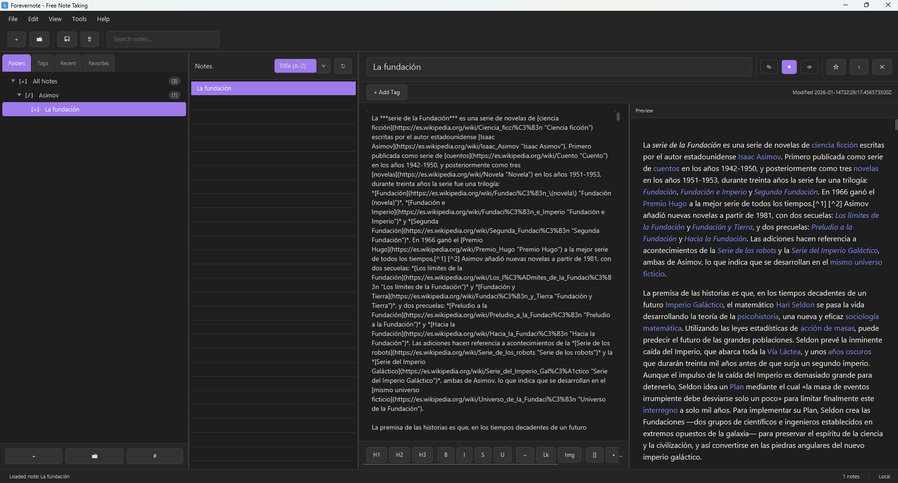

# Forevernote

<div align="center">
  <strong>Español</strong> |
  <a href="README.md">English</a>
</div>

<div align="center">
  
</div>

<div align="center">

[](LICENSE)
[](changelog.md)
[](https://www.oracle.com/java/)
[](https://openjfx.io/)
[](https://www.sqlite.org/)
[](https://maven.apache.org/)
[]()

</div>

<div align="center">
  <strong>Aplicación de notas de escritorio local-first con preview Markdown, plugins, temas y backend dual de almacenamiento.</strong>
</div>

## Índice

- [Resumen](#resumen)
- [Funcionalidades](#funcionalidades)
- [Capturas](#capturas)
- [Stack Tecnológico](#stack-tecnológico)
- [Requisitos](#requisitos)
- [Inicio Rápido](#inicio-rápido)
- [Scripts y Comandos (Todos los SO)](#scripts-y-comandos-todos-los-so)
- [Estructura del Proyecto](#estructura-del-proyecto)
- [Configuración](#configuración)
- [Documentación](#documentación)
- [Resolución de Problemas](#resolución-de-problemas)
- [Contribución](#contribución)
- [Licencia](#licencia)

## Resumen

Forevernote es una app Java 17 + JavaFX 21 inspirada en flujos tipo Obsidian:

- Escritura/edición rápida con preview Markdown
- Jerarquía de carpetas + tags + favoritos + recientes + papelera
- Command Palette y Quick Switcher
- Plugins externos (`plugins/`) y temas externos (`themes/`)
- Modo de almacenamiento SQLite o FileSystem vault

## Funcionalidades

### Núcleo

- Crear, editar, guardar, eliminar y restaurar notas
- Carpetas y subcarpetas jerárquicas
- Etiquetas con asignación/eliminación
- Favoritos y notas recientes
- Papelera con restauración de notas y carpetas anidadas
- Búsqueda global y ordenación

### Editor y Preview

- Render Markdown con tablas GFM, autolinks y strikethrough
- Vista previa en vivo y modo dividido
- Resaltado de sintaxis para bloques de código (highlight.js)

### UI/UX

- Temas claro, oscuro, sistema + externos
- Tema retro fósforo de ejemplo
- Preferencias para mostrar tabs/botones en texto/iconos/auto
- Vista de notas en lista y cuadrícula
- Layout compacto y responsive

### Extensibilidad

- Carga de plugins JAR externos desde `plugins/`
- Gestor de plugins en UI
- Lifecycle de plugins (load/enable/disable/shutdown)
- Catálogo de temas externos con fallback seguro

## Capturas

### Interfaz Principal



### Tema Oscuro



### Tema Claro



### Editor y Preview



## Stack Tecnológico

- Java 17
- JavaFX 21
- Maven 3.9+
- SQLite JDBC
- CommonMark
- Ikonli (Feather icons)
- JUnit 5 + H2 (tests)

## Requisitos

1. Java JDK 17
2. Maven 3.9+

Comprobación:

```bash
java -version
mvn -version
```

## Inicio Rápido

### 1) Clonar

```bash
git clone https://github.com/RGiskard7/Forevernote.git
cd Forevernote
```

### 2) Compilar

```bash
./scripts/build_all.sh
```

```powershell
.\scripts\build_all.ps1
```

### 3) Ejecutar

```bash
./scripts/launch-forevernote.sh
```

```powershell
.\scripts\launch-forevernote.bat
# o
.\scripts\launch-forevernote.ps1
```

## Scripts y Comandos (Todos los SO)

Todos los comandos asumen raíz del repo:

`/Users/edu/visual-studio-code-workspace/Forevernote`

### Matriz Build / Run

| Propósito | Linux/macOS | Windows PowerShell | Windows CMD |
|---|---|---|---|
| Compilar app | `./scripts/build_all.sh` | `.\scripts\build_all.ps1` | N/A |
| Ejecutar app (runner dev) | `./scripts/run_all.sh` | `.\scripts\run_all.ps1` | N/A |
| Ejecutar app (launcher recomendado) | `./scripts/launch-forevernote.sh` | `.\scripts\launch-forevernote.ps1` | `.\scripts\launch-forevernote.bat` |

### Tests y Gates de Calidad

```bash
mvn -f Forevernote/pom.xml test
mvn -f Forevernote/pom.xml clean test
```

```bash
./scripts/smoke-phase-gate.sh
./scripts/hardening-storage-matrix.sh
```

```powershell
.\scripts\smoke-phase-gate.ps1
.\scripts\hardening-storage-matrix.ps1
```

### Plugins (JAR externos)

```bash
./scripts/build-plugins.sh
./scripts/build-plugins.sh --clean
```

```powershell
.\scripts\build-plugins.ps1
.\scripts\build-plugins.ps1 -Clean
```

### Temas (externos)

```bash
./scripts/build-themes.sh
./scripts/build-themes.sh --clean
./scripts/build-themes.sh --appdata
```

```powershell
.\scripts\build-themes.ps1
.\scripts\build-themes.ps1 -Clean
.\scripts\build-themes.ps1 -AppData
```

### Empaquetado

```bash
mvn -f Forevernote/pom.xml clean package -DskipTests
./scripts/package-linux.sh
./scripts/package-macos.sh
```

```powershell
.\scripts\package-windows.ps1
```

Los scripts de empaquetado ya preparan automáticamente plugins y temas externos antes de ejecutar `jpackage`:
- `package-macos.sh` -> ejecuta `build-plugins.sh` + `build-themes.sh`
- `package-linux.sh` -> ejecuta `build-plugins.sh` + `build-themes.sh`
- `package-windows.ps1` -> ejecuta `build-plugins.ps1` + `build-themes.ps1`

### Ejecución Maven (desarrollo)

```bash
mvn -f Forevernote/pom.xml clean compile exec:java -Dexec.mainClass="com.example.forevernote.Launcher"
```

## Estructura del Proyecto

```text
Forevernote/
├── Forevernote/
│   ├── pom.xml
│   ├── src/main/java/com/example/forevernote/
│   │   ├── config/
│   │   ├── data/
│   │   ├── event/
│   │   ├── exceptions/
│   │   ├── plugin/
│   │   ├── service/
│   │   ├── sync/
│   │   ├── ui/
│   │   └── util/
│   ├── src/main/resources/com/example/forevernote/
│   │   ├── i18n/
│   │   ├── plugin/
│   │   ├── ui/css/
│   │   ├── ui/preview/
│   │   └── ui/view/
│   ├── src/test/
│   └── themes/                     # temas externos instalados en runtime
├── plugins/                        # jars de plugins externos
├── plugins-source/                 # workspace de plugins de ejemplo
├── themes/                         # temas externos fuente
├── scripts/
├── doc/
├── AGENTS.md
├── changelog.md
├── README.md
└── README.es.md
```

## Configuración

### Almacenamiento

- SQLite (por defecto) o modo FileSystem vault
- Directorios runtime creados automáticamente:
  - `Forevernote/data/`
  - `Forevernote/logs/`

### Temas

Formato de tema externo:

```text
themes/<theme-id>/theme.properties
themes/<theme-id>/theme.css
```

### Plugins

- Coloca JARs de plugin en `plugins/`
- Usa el gestor de plugins del menú Herramientas para habilitar/deshabilitar

### ¿Hay Que Mover Plugins/Temas Manualmente?

Respuesta corta: normalmente **no**.

- Ejecución en desarrollo (`run_all.*` / `launch-forevernote.*`):
  - `build-plugins.*` deja los JARs en `Forevernote/plugins/`
  - `build-themes.*` deja los temas en `Forevernote/themes/`
  - La app resuelve ambas rutas directamente, sin mover nada.

- Instaladores empaquetados (`package-*`):
  - Los scripts ya compilan/preparan plugins y temas automáticamente.
  - Si tu JDK soporta `jpackage --app-content`, plugins/temas se incluyen en el paquete.
  - Si no (habitual con JDK 17), la app funciona igual pero el usuario debe copiarlos en AppData:
    - Windows: `%APPDATA%\Forevernote\plugins` y `%APPDATA%\Forevernote\themes`
    - macOS: `~/Library/Application Support/Forevernote/plugins` y `~/Library/Application Support/Forevernote/themes`
    - Linux: `~/.config/Forevernote/plugins` y `~/.config/Forevernote/themes`

## Documentación

- [doc/BUILD.md](doc/BUILD.md)
- [doc/ARCHITECTURE.md](doc/ARCHITECTURE.md)
- [doc/PLUGINS.md](doc/PLUGINS.md)
- [doc/LAUNCH_APP.md](doc/LAUNCH_APP.md)
- [doc/PACKAGING.md](doc/PACKAGING.md)
- [doc/EVENT_BUS_CONTRACT.md](doc/EVENT_BUS_CONTRACT.md)
- [doc/DEFINITION_OF_DONE.md](doc/DEFINITION_OF_DONE.md)
- [doc/PROJECT_STATUS.md](doc/PROJECT_STATUS.md)
- [doc/PROJECT_ANALYSIS.md](doc/PROJECT_ANALYSIS.md)
- [AGENTS.md](AGENTS.md)

## Resolución de Problemas

### Errores JavaFX Runtime

Si tienes errores de JavaFX/module-path, usa los launchers (`launch-forevernote.*`) en lugar de ejecutar el JAR directamente.

### Java o Maven no encontrados

Asegura ambos en `PATH`:

```bash
java -version
mvn -version
```

### Warnings de parent-POM JavaFX

Warnings del tipo `Failed to build parent project for org.openjfx:javafx-*` son conocidos y no bloqueantes.

## Contribución

- Cambios pequeños e incrementales.
- Ejecutar tests antes de PR.
- Mantener compatibilidad SQLite/FileSystem y plugins.
- Actualizar documentación cuando cambie comportamiento.

## Licencia

MIT. Ver [LICENSE](LICENSE).
