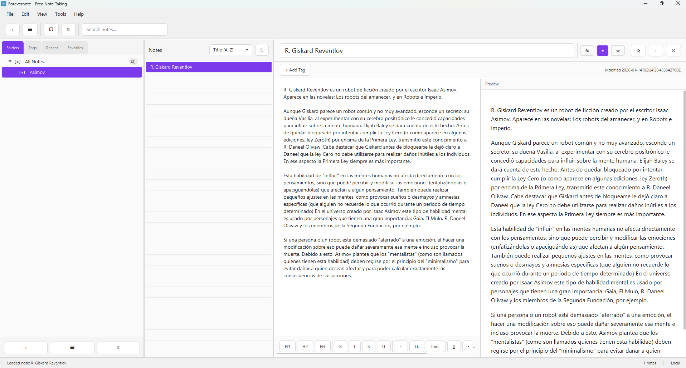
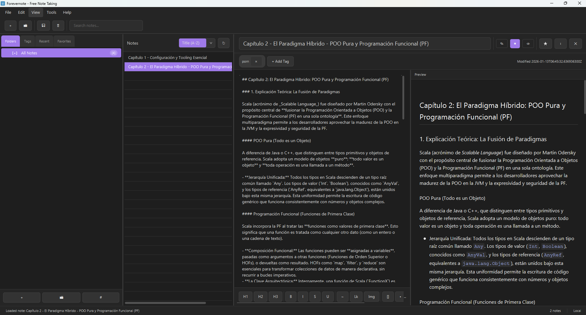
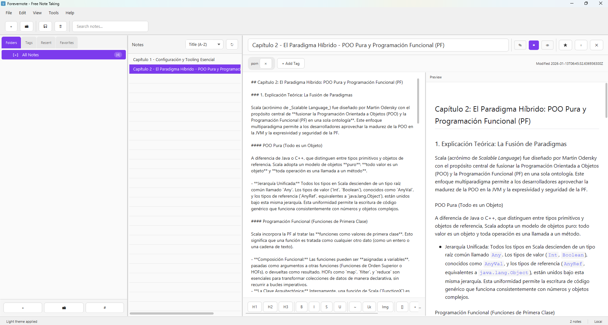
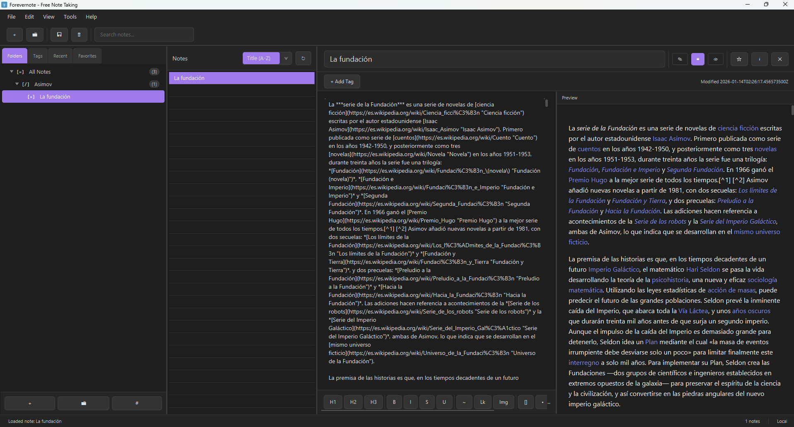

# Forevernote

<div align="center">
  
</div>

<div align="center">

[](https://opensource.org/licenses/MIT)
[](https://www.oracle.com/java/)
[](https://openjfx.io/)
[](https://www.sqlite.org/)
[](https://maven.apache.org/)
[]()

</div>

<div align="center">
  <strong>A lightweight desktop application for managing notes with hierarchical organization through folders and tags.</strong>
  <br>
  Built with Java and JavaFX, featuring SQLite for persistent storage, Markdown support with live preview, and a modern, intuitive user interface inspired by Obsidian.
</div>

## Table of Contents

- [Features](#features)
- [Screenshots](#screenshots)
- [Technology Stack](#technology-stack)
- [Prerequisites](#prerequisites)
- [Quick Start](#quick-start)
- [Documentation](#documentation)
- [Project Structure](#project-structure)
- [Configuration](#configuration)
- [Troubleshooting](#troubleshooting)
- [Development](#development)
- [License](#license)
- [Contributing](#contributing)

## Features

- **Note Management**: Create, edit, and delete notes with titles and content
- **Folder Organization**: Organize notes hierarchically using notebooks/folders with visible "All Notes" root
- **Tags**: Categorize and search notes using tags with full tag management interface
- **Markdown Support**: Write notes in Markdown with live preview and emoji support
- **Rich Text Formatting**: Bold, italic, underline, links, images, todo lists, and numbered lists
- **Search**: Global search across all notes (titles and content)
- **Auto-refresh**: Notes list automatically updates on save/delete operations
- **Obsidian-style Interface**: Split view editor with toggle between editor-only, split, and preview-only modes
- **Theme Support**: Light, dark, and system theme options with professional styling
- **Keyboard Shortcuts**: Comprehensive keyboard shortcuts for all operations
- **Command Palette**: Quick command access (Ctrl+P) for power users
- **Quick Switcher**: Fast note navigation (Ctrl+O)
- **Favorites**: Mark notes as favorites for quick access
- **Recent Notes**: Quick access to recently modified notes
- **Responsive Design**: Fully responsive interface that adapts to window resizing
- **Scrollable Toolbar**: Professional format toolbar with horizontal scrolling

## Screenshots

### Main Interface



The main interface features a three-panel layout: navigation sidebar (folders, tags, recent, favorites), notes list, and editor with live preview.

### Dark Theme



Professional dark theme with purple accents, optimized for extended writing sessions.

### Light Theme



Clean light theme with modern styling and excellent readability.

### Editor Features



Split-view editor with Markdown formatting toolbar, live preview, and comprehensive note management tools.

## Technology Stack

- **Java 17**: Core programming language (required)
- **JavaFX 21**: Desktop user interface framework
- **SQLite**: Lightweight relational database
- **Maven 3.9+**: Build automation and dependency management
- **JUnit 5**: Unit testing framework
- **CommonMark**: Markdown processing library

## Prerequisites

### Required Software

1. **Java JDK 17** (required)
   - Download from: https://adoptium.net/ or https://www.oracle.com/java/technologies/javase/jdk17-archive-downloads.html
   - **Important**: You need JDK (Java Development Kit), not just JRE (Java Runtime Environment)
   - Verify installation:
     ```bash
     java -version
     # Should show: openjdk version "17" or java version "17"
     ```

2. **Apache Maven 3.6+** (required for building)
   - Download from: https://maven.apache.org/download.cgi
   - Or use package managers:
     - **Windows**: `choco install maven` or `winget install Apache.Maven`
     - **macOS**: `brew install maven`
     - **Linux (Ubuntu/Debian)**: `sudo apt-get install maven`
   - Verify installation:
     ```bash
     mvn -version
     # Should show: Apache Maven 3.x.x
     ```

### Optional: VS Code Extensions

For development in VS Code, install:
- **Extension Pack for Java** (includes Java Language Support, Debugger, Test Runner, etc.)
- **Maven for Java**

## Quick Start

### 1. Clone the Repository

```bash
git clone https://github.com/RGiskard7/Forevernote.git
cd Forevernote
```

### 2. Build the Project

**Windows (PowerShell):**
```powershell
.\scripts\build_all.ps1
```

**macOS/Linux (Bash):**
```bash
./scripts/build_all.sh
```

This creates an executable JAR at `Forevernote/target/forevernote-1.0.0-uber.jar`.

**Note**: During compilation, you may see warnings like "Failed to build parent project for org.openjfx:javafx-*". These are normal and harmless - they occur because Maven tries to build the JavaFX parent project, which is not necessary. The build will still succeed.

### 3. Run the Application

**Windows (PowerShell):**
```powershell
.\scripts\run_all.ps1
```

**Windows (CMD):**
```cmd
.\scripts\launch-forevernote.bat
```

**macOS/Linux (Bash):**
```bash
./scripts/launch-forevernote.sh
```

The scripts automatically detect JavaFX modules in your Maven repository and configure the Java module-path correctly.

For more detailed build and setup instructions, see [Build and Setup Guide](doc/BUILD.md).

## Documentation

Comprehensive documentation is available in the `doc/` directory:

- **[Build and Setup Guide](doc/BUILD.md)**: Complete guide for building, running, and setting up the development environment. Includes prerequisites, build methods, VS Code configuration, troubleshooting, and project structure.

- **[Architecture Documentation](doc/ARCHITECTURE.md)**: Detailed explanation of the application architecture, design patterns, and component structure.

- **[Standalone Application Guide](doc/LAUNCH_APP.md)**: Instructions for using Forevernote as a standalone application without development tools. Covers executable JAR usage, launch scripts, and creating desktop shortcuts.

- **[Native Installer Guide](doc/PACKAGING.md)**: Guide for creating native installers (MSI for Windows, DMG for macOS, DEB/RPM for Linux) using jpackage. Includes prerequisites, platform-specific instructions, and distribution guidelines.

For agent-oriented development guidelines, see [AGENTS.md](AGENTS.md).

## Project Structure

```
Forevernote/
├── Forevernote/                          # Main project module
│   ├── src/
│   │   ├── main/
│   │   │   ├── java/com/example/forevernote/
│   │   │   │   ├── Main.java            # Application entry point
│   │   │   │   ├── config/              # Configuration classes
│   │   │   │   ├── data/                # Data access layer
│   │   │   │   │   ├── SQLiteDB.java    # Database connection management
│   │   │   │   │   ├── dao/             # Data Access Objects
│   │   │   │   │   └── models/          # Data models (Note, Folder, Tag)
│   │   │   │   ├── exceptions/          # Custom exceptions
│   │   │   │   ├── ui/                  # User interface
│   │   │   │   │   ├── controller/      # JavaFX controllers
│   │   │   │   │   ├── view/            # FXML layouts
│   │   │   │   │   ├── css/             # Stylesheets
│   │   │   │   │   └── components/      # Reusable UI components
│   │   │   │   ├── service/             # Business logic layer
│   │   │   │   ├── event/               # Event system
│   │   │   │   └── plugin/              # Plugin system
│   │   │   └── resources/               # Configuration and assets
│   │   └── test/                        # Unit tests
│   ├── pom.xml                          # Maven configuration
│   ├── target/                          # Build output directory
│   ├── data/                            # Runtime data directory (created on first run)
│   └── logs/                            # Runtime logs directory (created on first run)
│
├── scripts/
│   ├── build_all.ps1                    # Windows build script
│   ├── build_all.sh                     # Unix build script
│   ├── run_all.ps1                      # Windows run script
│   ├── run_all.sh                       # Unix run script
│   ├── launch-forevernote.ps1           # Windows PowerShell standalone launcher
│   ├── launch-forevernote.bat           # Windows CMD standalone launcher
│   ├── launch-forevernote.sh            # Unix standalone launcher
│   ├── schema.txt                       # Database schema definition
│   ├── package-windows.ps1              # Windows installer generator
│   ├── package-macos.sh                 # macOS installer generator
│   ├── package-linux.sh                 # Linux installer generator
│   └── README.md                        # Scripts documentation
│
├── doc/                                  # Documentation
│   ├── BUILD.md                          # Build and setup guide
│   ├── ARCHITECTURE.md                   # Architecture documentation
│   ├── LAUNCH_APP.md                     # Standalone application guide
│   ├── PACKAGING.md                      # Native installer guide
│   └── interfaz-*.png                    # Application screenshots
│
├── .vscode/                              # VS Code configuration
│   ├── settings.json                     # Java configuration
│   ├── tasks.json                       # Build tasks
│   ├── launch.json                       # Debug/run configurations
│   └── extensions.json                  # Recommended extensions
│
├── README.md                             # This file
├── AGENTS.md                             # Agent-oriented development guide
├── changelog.md                          # Project changelog
└── LICENSE                               # MIT License
```

## Configuration

### Database

The application automatically creates a SQLite database at `Forevernote/data/database.db` on first run (when executed from the `Forevernote/` directory). The database includes tables for notes, folders, tags, and their relationships.

For the complete database schema, see [`scripts/schema.txt`](scripts/schema.txt). This file contains the SQL schema definition that can be used to manually create or restore the database structure.

**Note**: The `data/` and `logs/` directories are created automatically when the application runs, not during compilation. The build scripts do not create these directories.

### Logging

Logging configuration is defined in `src/main/resources/logging.properties`. Logs are written to the `Forevernote/logs/` directory by default (created automatically on first run).

### JavaFX Module-Path

The build and run scripts automatically detect JavaFX modules from your Maven repository (`~/.m2/repository/org/openjfx/`). They use specific JAR files (not directories) to avoid loading `-sources.jar` files as modules.

If running the JAR directly fails, use the provided scripts which handle module-path configuration automatically.

## Troubleshooting

### Build Warnings

**Warning**: "Failed to build parent project for org.openjfx:javafx-*"
- **Status**: Normal and harmless
- **Explanation**: Maven tries to build the JavaFX parent project, which is not necessary
- **Action**: Ignore these warnings - they don't affect functionality

**Warning**: "6 problems were encountered while building the effective model"
- **Status**: Normal and harmless
- **Explanation**: Related to the JavaFX parent project warnings
- **Action**: Ignore - build will still succeed

### Runtime Errors

**Error**: "JavaFX runtime components are missing"
- **Solution**: Use the run scripts (`.\scripts\run_all.ps1` or `./scripts/run_all.sh`)
- **Alternative**: Run via Maven: `mvn javafx:run` or `mvn exec:java -Dexec.mainClass="com.example.forevernote.Main"`

**Error**: "Invalid module name: '21' is not a Java identifier"
- **Solution**: This was fixed in the scripts. Make sure you're using the latest version of the scripts
- **Cause**: Scripts were pointing to directories containing `-sources.jar` files
- **Fix**: Scripts now use specific JAR file paths

### VS Code Issues

**Problem**: JavaFX imports show errors
- **Solution**: 
  1. `Ctrl+Shift+P` → `Java: Clean Java Language Server Workspace`
  2. `Ctrl+Shift+P` → `Java: Reload Projects`
  3. Wait for Maven to sync (1-2 minutes)

**Problem**: VS Code uses wrong Java version
- **Solution**: 
  1. `Ctrl+Shift+P` → `Java: Configure Java Runtime`
  2. Set Java 17 as default
  3. Check `.vscode/settings.json` has `"java.jdt.ls.java.home": "C:\\Program Files\\Java\\jdk-17"` (adjust path for your system)

**Problem**: Can't run from VS Code
- **Solution**: Use "Launch Forevernote (Maven JavaFX)" configuration which handles everything automatically

For more detailed troubleshooting information, see the [Build and Setup Guide](doc/BUILD.md).

## Development

### Running Tests

```bash
cd Forevernote
mvn test
```

### Code Style

- Follow Java naming conventions (PascalCase for classes, camelCase for methods/variables)
- Use `LoggerConfig.getLogger(ClassName.class)` for logging (not `System.out.println`)
- Handle exceptions appropriately (use custom exceptions from `exceptions/` package)
- No wildcard imports (`import java.util.*` not allowed)

### Adding Dependencies

Add dependencies to `Forevernote/pom.xml` in the `<dependencies>` section. Maven will automatically download them.

For detailed development guidelines, see [AGENTS.md](AGENTS.md).

## License

This project is licensed under the MIT License. See the [LICENSE](LICENSE) file for details.

## Contributing

Contributions are welcome! Please feel free to submit a Pull Request.

For detailed development guidelines and contribution standards, see [AGENTS.md](AGENTS.md).

---

<p align="center">
  <small>Developed by <b>Edu Díaz</b> (<b>RGiskard7</b>)</small>
</p>
