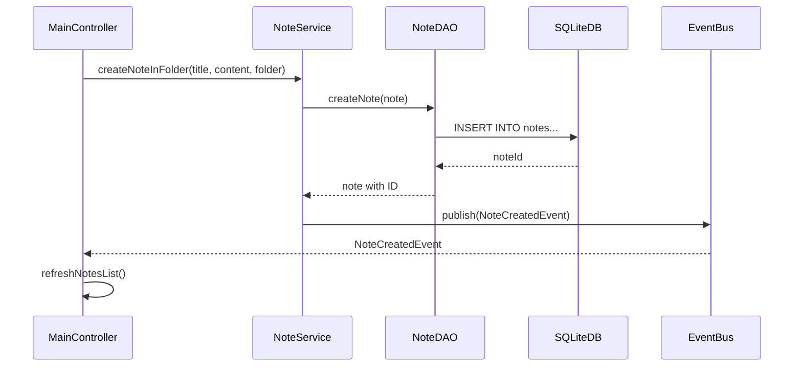
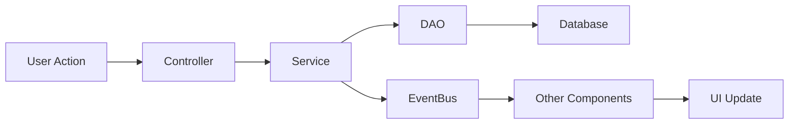

# Forevernote Architecture

This document describes the software architecture of Forevernote, a desktop note-taking application built with Java and JavaFX.

## Overview

Forevernote follows a **layered architecture** with clear separation of concerns:

```
┌─────────────────────────────────────────────────────────────┐
│                     UI Layer (JavaFX)                       │
│  ┌─────────────┐ ┌─────────────┐ ┌─────────────────────────┐│
│  │ Controllers │ │ Components  │ │ FXML Views              ││
│  └─────────────┘ └─────────────┘ └─────────────────────────┘│
├─────────────────────────────────────────────────────────────┤
│                     Service Layer                           │
│  ┌─────────────┐ ┌─────────────┐ ┌─────────────────────────┐│
│  │ NoteService │ │FolderService│ │ TagService              ││
│  └─────────────┘ └─────────────┘ └─────────────────────────┘│
├─────────────────────────────────────────────────────────────┤
│                     Event System                            │
│  ┌─────────────────────────────────────────────────────────┐│
│  │                    EventBus                              ││
│  └─────────────────────────────────────────────────────────┘│
├─────────────────────────────────────────────────────────────┤
│                     Data Access Layer (DAO)                 │
│  ┌─────────────┐ ┌─────────────┐ ┌─────────────────────────┐│
│  │  NoteDAO    │ │  FolderDAO  │ │ TagDAO                  ││
│  └─────────────┘ └─────────────┘ └─────────────────────────┘│
├─────────────────────────────────────────────────────────────┤
│                     Persistence (SQLite)                    │
│  ┌─────────────────────────────────────────────────────────┐│
│  │                    SQLiteDB                              ││
│  └─────────────────────────────────────────────────────────┘│
└─────────────────────────────────────────────────────────────┘
```

## Package Structure

```
com.example.forevernote/
├── Main.java                    # Application entry point
├── Launcher.java                # JavaFX launcher workaround
├── AppConfig.java               # Application configuration
├── AppDataDirectory.java        # Data directory management
│
├── config/                      # Configuration classes
│   └── LoggerConfig.java        # Logging configuration
│
├── data/                        # Data layer
│   ├── SQLiteDB.java            # Database connection manager
│   ├── dao/                     # Data Access Objects
│   │   ├── interfaces/          # DAO interfaces
│   │   │   ├── NoteDAO.java
│   │   │   ├── FolderDAO.java
│   │   │   └── TagDAO.java
│   │   ├── abstractLayers/      # Abstract factory
│   │   │   └── FactoryDAO.java
│   │   ├── NoteDAOSQLite.java   # SQLite implementations
│   │   ├── FolderDAOSQLite.java
│   │   ├── TagDAOSQLite.java
│   │   └── FactoryDAOSQLite.java
│   └── models/                  # Domain models
│       ├── interfaces/
│       │   └── Component.java   # Composite pattern interface
│       ├── abstractLayers/
│       │   ├── BaseModel.java
│       │   ├── CompositeModel.java
│       │   └── LeafModel.java
│       ├── Note.java
│       ├── Folder.java
│       ├── Tag.java
│       └── ToDoNote.java
│
├── service/                     # Business logic layer
│   ├── NoteService.java         # Note operations
│   ├── FolderService.java       # Folder operations
│   └── TagService.java          # Tag operations
│
├── event/                       # Event system
│   ├── EventBus.java            # Pub/sub event bus
│   ├── AppEvent.java            # Base event class
│   └── events/                  # Event definitions
│       ├── NoteEvents.java
│       ├── FolderEvents.java
│       ├── TagEvents.java
│       └── UIEvents.java
│
├── plugin/                      # Plugin system
│   ├── Plugin.java              # Plugin interface
│   ├── PluginContext.java       # Plugin API
│   └── PluginManager.java       # Plugin lifecycle
│
├── ui/                          # User interface
│   ├── controller/              # JavaFX controllers
│   │   └── MainController.java
│   ├── components/              # Reusable UI components
│   │   ├── CommandPalette.java
│   │   └── QuickSwitcher.java
│   ├── view/                    # FXML layouts (in resources)
│   └── css/                     # Stylesheets (in resources)
│
├── util/                        # Utilities
│   ├── MarkdownProcessor.java   # Markdown to HTML
│   ├── KeyboardShortcuts.java   # Keyboard handling
│   ├── ShortcutHandler.java
│   └── Animations.java          # UI animations
│
└── exceptions/                  # Custom exceptions
    ├── DataAccessException.java
    ├── NoteException.java
    ├── NoteNotFoundException.java
    └── InvalidParameterException.java
```

## Design Patterns

### 1. Factory Pattern (DAO Creation)

The `FactoryDAO` abstract class provides factory methods for creating DAO instances:

```java
FactoryDAO factory = FactoryDAO.getFactory(FactoryDAO.SQLITE_FACTORY, connection);
NoteDAO noteDAO = factory.getNoteDAO();
FolderDAO folderDAO = factory.getFolderDAO();
TagDAO tagDAO = factory.getLabelDAO();
```

This allows switching database implementations without changing business logic.

### 2. Composite Pattern (Folder Hierarchy)

The folder structure uses the Composite pattern:

```
Component (interface)
    ├── LeafModel (abstract) → Note
    └── CompositeModel (abstract) → Folder
```

This enables uniform treatment of notes and folders in the hierarchy.

### 3. Singleton Pattern (Database, EventBus)

- `SQLiteDB.getInstance()` - Single database connection manager
- `EventBus.getInstance()` - Single event bus instance

### 4. Observer/Pub-Sub Pattern (EventBus)

Components communicate through events:

```java
// Subscribe
EventBus.getInstance().subscribe(NoteSavedEvent.class, event -> {
    refreshNotesList();
});

// Publish
EventBus.getInstance().publish(new NoteSavedEvent(note));
```

### 5. Service Layer Pattern

Business logic is encapsulated in services:

```java
NoteService noteService = new NoteService(noteDAO, folderDAO, tagDAO);
Note note = noteService.createNoteInFolder("Title", "Content", folder);
List<Note> results = noteService.searchNotes("query");
```

## Component Interactions

### Note Creation Flow



### Event Flow



## Plugin System

### Plugin Lifecycle

1. **Registration** - Plugin is registered with PluginManager
2. **Initialization** - Plugin receives PluginContext and sets up
3. **Active** - Plugin responds to events and provides functionality
4. **Shutdown** - Plugin cleans up resources

### Plugin API

Plugins have access to:

- **Services**: NoteService, FolderService, TagService
- **Events**: Subscribe and publish through EventBus
- **Commands**: Register commands in Command Palette
- **Logging**: Contextual logging

```java
public class MyPlugin implements Plugin {
    @Override
    public void initialize(PluginContext context) {
        // Register command
        context.registerCommand("My Command", "Description", () -> {
            // Action
        });
        
        // Subscribe to events
        context.subscribe(NoteSavedEvent.class, event -> {
            // Handle
        });
    }
}
```

## UI Components

### Command Palette

- Keyboard-driven command execution (Ctrl+P)
- Fuzzy search across all commands
- Category organization
- Stable internal command IDs (`cmd.*`) with backward-compatible aliases
- Command dispatch in `MainController` via routing table (`Map<String, Runnable>`) to reduce cyclomatic complexity and decouple from visible labels

### Quick Switcher

- Fast note navigation (Ctrl+O)
- Fuzzy search across note titles and content
- Recent notes prioritization

## Data Flow

### Read Path

```
UI Request → Service → DAO → SQLite → DAO → Service → UI Update
```

### Write Path

```
UI Action → Service → DAO → SQLite → EventBus → Subscribers → UI Update
```

## Threading Model

- **Main Thread**: UI operations (JavaFX Application Thread)
- **Database**: Synchronous operations (same thread)
- **Events**: Dispatched on JavaFX Application Thread via `Platform.runLater()`

## Configuration

### Database

- Location: `data/database.db` (relative to working directory)
- Schema: See `scripts/schema.txt`
- Auto-created on first run

### Logging

- Configuration: `src/main/resources/logging.properties`
- Output: `logs/` directory
- Levels: INFO, WARNING, SEVERE

### Themes

- Light: `modern-theme.css`
- Dark: `dark-theme.css`
- Persistence: Java Preferences API

## Extension Points

1. **New DAO Implementations**: Implement DAO interfaces for different databases
2. **New Plugins**: Implement Plugin interface
3. **New Events**: Extend AppEvent class
4. **New Services**: Follow service layer pattern
5. **UI Components**: Add to `ui/components/`

## Future Considerations

- **Cloud Sync**: Would require new sync service and conflict resolution
- **Encryption**: Can be added at DAO level or service level
- **Multi-window**: Would need shared service instances
- **Full-text Search**: Could use SQLite FTS5 extension

---

For development guidelines, see [AGENTS.md](../AGENTS.md).
For build instructions, see [BUILD.md](BUILD.md).
